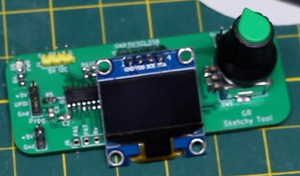

# Sketchy Tool
Help tweak a sketch without having to re-program so frequently  
  
Send configurable data over I2C to another project so it can tweak parameters on the fly instead of having to re-upload software
